# Development

This document describes the design and implementation of the `libuipc`, providing a reference for developers who wish to contribute to the project. Here, we will mainly focus on the backend implementation of the framework.

## Data Oriented Programming

The Partial Differential Equation (PDE) of the simulation problem is already an abstract representation of the real world. We don't need to make any conceptual abstraction using [Object Oriented Programming](https://en.wikipedia.org/wiki/Object-oriented_programming) (OOP) to represent the objects. Instead, we keep [Data Oriented Programming](https://en.wikipedia.org/wiki/Data-oriented_design) (DOP) in mind to represent the data in a way that is cache-friendly and efficient. In some way, we organize the UIPC framework in a modified [Entity Component System](https://en.wikipedia.org/wiki/Entity_component_system) (ECS) pattern, which is called the [Reporter-Manager-Receiver](#Reporter-Manager-Receiver-Model) (RMR) model.

## Reporter-Manager-Receiver Model

The model is a conceptual design pattern that organizes the data flow between different components of the framework in a safe, cache-friendly and flexible way.

