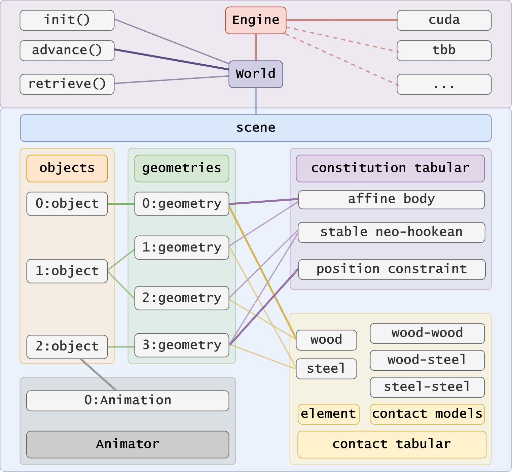

# Concepts

Here is an illustration of almost all the concepts and their relationship in `libuipc`. It might look a little bit complicated, but don't worry, we will explain it step by step.



As we can see, there are 3 top-most concepts in `libuipc`, they are:

- `Engine`
- `World`
- `Scene`

Conceptually, `World` is something **interests** us. `Engine` is the **heart** of the simulation, which drives the `World` evolution. `Scene` is a **snapshot** of the `World` at a certain time point, and contains all information we needed to drive the simulation.

From the aspect of 'programming', `Engine` is some **simulation algorithms** running on some **computing devices**, it can be `ipc-on-cuda`, `ipc-on-tbb` or even `any-method-on-any-device`, which is called the **backend** of `libuipc`. `World` is an interface exploiting the life-cycle of the simulation, you can `init()` it, `advance()` the simulation by one step, `retrieve()` the simulation data back and so on. `Scene` is a **data structure** that contains the 'current state' and the 'initial state' of the world, which is all the information we need to simulate the world.


## Scene

Scene in `libuipc` is a whole set of entities we need to simulate the world.

There are 5 main parts in a scene:

| Term | Description |
| ---- | ----------- |
|[**Objects**](#object)   | **Objects** are some concrete entities, such as a T-shirt, a box, etc. They may can be described by a set of geometries. For example, a T-shirt may have several pieces of cloth, producted by different materials (constitutions) and have different contact behaviors (contact models).|
|**Geometries**           | **Geometries** are all the basic [geometries](geometry.md) that are used to build objects in the scene. The ownership of the geometries is kept by the scene.|
|**Constitution Tabular** | **Constitution Tabular** is a collection of all the constitutions that are used in the scene. A constitution is a set of properties that define the physics behavior of the object. For example, a famous constitution is the [Neo-Hookean](https://en.wikipedia.org/wiki/Neo-Hookean_solid) model, which is used to simulate the deformation of rubber-like materials.|
|**Contact Tabular**      | **Contact Tabular**  is a collection of all the contact models that are used in the scene. A contact model is a set of properties that define the contact behavior of the object. Typically, the properties include the friction coefficient, the restitution coefficient, etc.|
|**Animator**             | **Animator** is a collection of all the animations that are used in the scene. An animation is a script that defines the motion of the object. |


=== "C++"

    The interfaces of `Engine`, `World`, `Scene`, `Object` are defined in the `uipc::core` namespace.

    ```cpp
    using namespace uipc::core;
    ```

=== "Python"

    The interfaces of `Engine`, `World`, `Scene`, `Object` are defined in the `uipc.core` module.

    ```python
    from uipc.core import *
    ```

Here is a simple example to create a scene:

First, we declare a scene.

=== "C++"

    ```cpp
    Scene scene;
    ```

=== "Python"

    ```python
    scene = Scene()
    ```

Then, we need to create a constitution for the object. Here we use the `AffineBodyConstitution` as an example, `AffineBodyConstitution` is a simple constitution that can be used to approximate the behavior of a rigid body.

We need to create a constitution for the object. Here we use the `AffineBodyConstitution` as an example, `AffineBodyConstitution` is a simple constitution that can be used to approximate the behavior of a rigid body.

=== "C++"

    ```cpp
    auto& constitution_tabular = scene.constitution_tabular();
    // create a constitution
    constitution::AffineBodyConstitution abd;
    // optional, libuipc will do this automatically under default configuration
    constitution_tabular.insert(abd); 
    // create a material with affine body stiffness 100 MPa
    auto abd_material = abd.create_material(100.0_MPa);
    ```

=== "Python"

    ```python
    constitution_tabular = scene.constitution_tabular()
    # create a constitution
    abd = constitution.AffineBodyConstitution()
    # optional, libuipc will do this automatically under default configuration
    constitution_tabular.insert(abd)
    # create a material with affine body stiffness 100 MPa
    abd_material = abd.create_material(100 * MPa)
    ```

To simulate the contact behavior of the object, we need to create a contact model. Note that the contact model has a pairwised relationship. For example, a contact tabular among wood, steel, and rubber can be defined as follows (imaginary values, just for demonstration):

|  fric  | wood | steel | rubber |
|--------|------|-------|--------|
| wood   | 0.5  | 0.3   | 0.6    |
| steel  |  -   | 0.2   | 0.4    |
| rubber |  -   |  -    | 0.7    |

=== "C++"

    ```cpp
    auto& contact_tabular = scene.contact_tabular();
    // create a contact element
    auto& wood_contact = contact_tabular.create("wood");
    // create self-contact model
    // friction coefficient is 0.5, restitution coefficient is 1.0 GPa
    contact_tabular.insert(wood_contact, wood_contact, 0.5, 1.0_GPa);
    ```

=== "Python"

    ```python
    contact_tabular = scene.contact_tabular()
    # create a contact element
    wood_contact = contact_tabular.create("wood")
    # create self-contact model
    # friction coefficient is 0.5, restitution coefficient is 1.0 GPa
    contact_tabular.insert(wood_contact, wood_contact, 0.5, 1.0 * GPa)
    ```

Now we can create a wooden cube object in the scene.
=== "C++"

    ```cpp
    // read a cube mesh from file
    geometry::SimplicialComplexIO io;
    auto cube = io.read("cube.msh");

    // apply the material and the contact model to the cube
    abd_material.apply_to(cube);
    wood_contact.apply_to(cube);

    // create an object
    auto wooden_cube = scene.objects().create("wooden_cube");

    // create a geometry for the object
    wooden_cube->geometries().create(cube);
    ```

=== "Python"

    ```python
    # read a cube mesh from file
    io = geometry.SimplicialComplexIO()
    cube = io.read("cube.msh")

    # apply the material and the contact model to the cube
    abd_material.apply_to(cube)
    wood_contact.apply_to(cube)

    # create an object
    wooden_cube = scene.objects().create("wooden_cube")

    # create a geometry for the object
    wooden_cube.geometries().create(cube)
    ```

A short summary of creating a scene:

1. setup the constitution tabular
2. setup the contact tabular
3. apply constitutions and contact elements to the geometries
4. create objects

## Object

Object in `libuipc` is a representation of the concrete entity in real world. It is something that touchable, visible, and can be interacted with. An object can be composed of one or more geometries, and each geometry can have its own constitution and contact model. 

Though a geometry share the same constitution and contact model, the **coefficients** of the constitution and the contact model can be different in the geometry. Some random perturbation can be added to the related attributes of the geometry to simulate the real world.

!!!info
    The coefficients of the constitution and the contact model can be stored in the attributes of the geometry. The backend can retrieve the coefficients from the attributes and simulate them properly.

## Constitution

Constitution is a set of coefficients and models that define the physics behavior of the object. Because there are so many different constitutions so far, we use a Consititution UID to identify all the constitutions `libuipc` supports. The specification of the constitutions can be found [here](../specification/constitution_uid.md).

For coding convenience, we provide some class like `AffineBodyConstitution` to help the user create a constitution. 

### Constraint

A constraint is a set of coefficients and models that define the constrained behavior of the object. For example, a transform constraint on affine body can force the affine body to move along certain trajectory specified by users. Constraint is always coupling with the animation (see [Animator](#animator)) to control the movement of the object.

### Material

Material is an instance of a constitution. A material has a concrete set of coefficients that define the physics behavior of the object. And it may be a short cut to apply the coefficients to the geometry.

## Contact Model

Contact model is a set of coefficients and models that define the contact behavior of the object. The contact model is a pairwised relationship, which means the contact model between two objects is different from the contact model between another two objects.

### Contact Element

A contact element is one side of the pairwised contact model, which has no meaning itself. The contact element IDs of two collided objects are used to find the contact model coefficients between them.

=== "C++"

    ```cpp
    wood_contact.id(); // 1
    ```

=== "Python"

    ```python
    wood_contact.id() # 1
    ```

Note that, `wood_contact` element id is `1`, because there is a default contact element with id `0`. The default contact model will be a fallback when the contact model between two objects is not defined.


[Discussion] Do we need to provide a `ContactModelUID` to identify the contact model? Because in GIPC we have new contact model based on an anisotropic constitutions.

## Animator

Animator contains a set of scripted animation that define the behavior of the object, such as the rotation, translation, per-vertex deformation and so on.

=== "C++"

    ```cpp
    auto& animator = scene.animator();
    ```

=== "Python"

    ```python
    animator = scene.animator()
    ```

To create an animation, we need following codes:

=== "C++"

    ```cpp
    // create an animation
    animator.insert(*obj,
        [](Animation::UpdateInfo& info)
        {
            auto geo_slots = info.geo_slots();
            for(auto& slot : geo_slots)
            {
                auto& geo = slot->geometry().as<SimplicialComplex>();
                ...
            }
        });
    ```

=== "Python"

    ```python
    # create an animation
    def update(info:Animation.UpdateInfo):
        geo_slots = info.geo_slots()
        for slot in geo_slots:
            geo:SimplicialComplex = slot.geometry()
            ...

    animator.insert(obj, update)
    ```

The `animator.insert()` takes an `object` instance and a function as input. The first argument tells `libuipc` which geometries need to be animated. The second argument is a function that will be called in each frame to update the geometry.

`geo_slots` are the geometries bound to the object with the creating order. Note that, we use the term `slot` to represent a position or a place holder not the geometry itself. The geometry reference can be retrieved by calling `geometry()` on the `slot`.

The way you modifying the animated geometries are dependent on the constraint you use. 

For example:

- If you use a `SoftTransformConstraint` on affine bodies, you can set the `is_constrained` attribute of the `instances` to `1` to enable the constraint on certain instances, and modify the `aim_transform` attribute of the `instances` to control the transform of the instances.
- If you use a `SoftPositionConstraint` on soft bodies, you can set the `is_constrained` attribute of the `vertices` to `1` to enable the constraint on certain vertices, and modify the `aim_position` attribute of the `vertices` to control the position of the vertices.

There will be a lot of other constraints provided in the future, and the way you modify the animated geometries will be different, please refer to the document of those constraints for more details.

A concrete tutorial of how to create an animation can be found here, [Animation Tutorial](animation.md).
