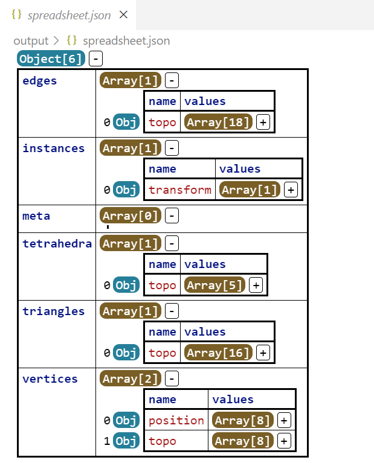

# Geometry

In simulation programs, geometry is a fundamental concept to represent the shape of the object, or rigrously, the domain of the simulation. 

There are several kinds of geometry, such as point cloud, line mesh, triangle mesh, quad mesh, polygon mesh, tetrahedral mesh, hexahedral mesh and so on, these geometries are called **explicit geometries**, because we use a discrete set of vertices and primitives to represent them. There are also some **implicit geometries**, such as the Signed Distance Field (SDF), which is a scalar field that represents the distance from the point to the surface of the geometry. It's inrealistic and inpractical to represent all the geometries in a single way, so we separate the geometries into several categories, and provide proper interfaces to access the relative information.

They are:

- [Simplicial Complex](#simplicial-complex): A unified representation of the explicit geometries, whose primitives are simplices, such as point, line, triangle, tetrahedron, etc. Some examples are point cloud, line mesh, triangle mesh, tetrahedral mesh, etc.
- [Implicit Geometry](#implicit-geometry): A presentation of the implicit geometries, such as the Signed Distance Field (SDF).
- ...

In this tutorial, we will focus on the simplicial complex, which is the most common geometry in the simulation programs. And describe the geometry interface in the `libuipc` library. 

=== "C++"

    All geometry interfaces are defined in the `uipc/geometry` namespace.
    
    ```cpp
    using namespace uipc::geometry;
    ```

=== "Python"

    All geometry interfaces are defined in the `pyuipc.geometry` module.
    
    ```python
    from uipc.geometry import *
    ```


## What makes a geometry?

The first question to come is what makes a geometry?

Our answer is:

$$
\text{Geometry} = \text{Topology} + \text{Attributes}
$$

Topologies describe how a geometry is connected, and attributes who have the same dimension as the topology carry the information of the geometry.

For example, to represent a 2D surface in a triangle mesh (like the famous `.obj` format), we store the positions of the vertices and the triangles that connect the vertices, as shown below:

$$
V = \{ 0,1,...,N-1 \},
$$

where $V$ is the set of vertices, and $N$ is the number of vertices.

We may store the positions of the vertices with the same count as the vertices:

$$
P = \{ \mathbf{x}_i\mid i \in V \}, \mathbf{x}_i \in \mathbb{R}^3.
$$

To represent the triangle, we may store the indices of the vertices that form the triangle:

$$
F = \{ (i,j,k) \mid i,j,k \in V \}.
$$

If we want to record the area of each triangle, we may store a float number for each triangle:

$$
A = \{ a_{ijk} \mid (i,j,k) \in F \}.
$$

In this example, the topology is the set of vertices $V$ and triangles $F$, and the attributes are the positions $P$ of the vertices and the area $A$ of the triangles, which obey the rule:

$$
|P| = |V|, |A| = |F|,
$$

where $|\bullet|$ tells the element count of the set.

With the same basic idea, we use a more general and well-defined way to represent such kind of geometry in the `libuipc` library, called [Simplicial Complex](https://brickisland.net/DDGSpring2022/course-description/), which is widely used in the diserete differential geometry.

## Simplicial Complex
In `libuipc`, a `Simplicial Complex` is a general representation of an explicit mesh. In $\mathbb{R}^3$, a simplicial complex can be a tetrahedral mesh, a triangle mesh, a line mesh, or a point cloud, which have a dimension of $3$, $2$, $1$, or $0$, respectively.

- The tetrahedral mesh can be used to describe solid objects.
- The triangle mesh can be used to describe some 2D-codimensional objects, like a cloth with a thin thickness or the surface of a solid object.
- The line mesh can be used to describe some 1D-codimensional objects, like a rope, a curve, or a wire.
- The point cloud can be used to describe some 0D-codimensional objects, like a bunch of particles.

=== "C++"

    The simplest way to create a simplicial complex is to use the `tetmesh()`, `trimesh()`, `linemesh()`, and `pointcloud()` functions, which are shown below:
    
    ```cpp
    auto tets = tetmesh(Vs,Ts);
    tets.dim(); // 3
    auto tris = trimesh(Vs,Fs);
    tris.dim(); // 2
    auto lines = linemesh(Vs,Es);
    lines.dim(); // 1
    auto points = pointcloud(Vs);
    points.dim(); // 0
    ```
    
    Or, you want to read the meshes from a file, you can use `SimplicialComplexIO`.
    
    ```cpp
    SimplicialComplexIO io;
    // .msh file
    auto tetmesh = io.read("bunny.msh");
    // .obj file
    auto trimesh = io.read("cloth.obj");
    // ... any other supported file format
    ```

=== "Python"

    The simplest way to create a simplicial complex is to use the `tetmesh()`, `trimesh()`, `linemesh()`, and `pointcloud()` functions:
    
    ```python
    tets = tetmesh(Vs,Ts)
    tets.dim() # 3
    tris = trimesh(Vs,Fs)
    tris.dim() # 2
    lines = linemesh(Vs,Es)
    lines.dim() # 1
    points = pointcloud(Vs)
    points.dim() # 0
    ```
    
    Or, you want to read the meshes from a file, you can use `SimplicialComplexIO`.
    
    ```python
    io = SimplicialComplexIO()
    # .msh file
    tetmesh = io.read('bunny.msh')
    # .obj file
    trimesh = io.read('cloth.obj')
    # ... any other supported file format
    ```

## Access Geometry Information

In `libuipc`, the data access and memory ownership of the geometry are separated. You can notice such a design almost everywhere in the library.

To access the geometry information, you need to create a `view` of the geometry, which is a lightweight object indicating the way we access the geometry, typically the read-only or read-write. 

For example, now we have a cube.

=== "C++"

    ```cpp
    SimplicialComplexIO io;
    auto cube = io.read("cube.msh");
    ```

=== "Python"

    ```python
    io = SimplicialComplexIO()
    cube = io.read('cube.msh')
    ```

To access the positions of the cube, we need to find the attribute of the positions.

=== "C++"

    The the atrribute `position` is of type `Vector3`.
    
    ```cpp
    auto VA = cube.vertices();
    auto pos = VA.find<Vector3>(builtin::position);
    ```
    
    The `builtin::position` is a predefined attribute name, which is the position of the vertices to avoid typo. You can also use a string to represent the attribute name.

=== "Python"

    ```python
    VA = cube.vertices()
    pos = VA.find(builtin.position)
    ```
    
    The `builtin.position` is a predefined attribute name, which is the position of the vertices to avoid typo. You can also use a string to represent the attribute name.

Note that, till now, we just get a handle of the attribute `position`. To access the data, we need to create a view of the attribute.

=== "C++"

    ```cpp
    span<const Vector3> const_view = pos->view();
    ```
    The view of the `position` is a `span<const Vector3>` (we explicitly define it here, but you can use `auto`), which is a const view of the position data. You can not modify the data through the view.

=== "Python"

    ```python
    const_view = pos.view()
    ```
    The view of the `position` is a `numpy.ndarray`, which is a const view of the position data. You can not modify the data through the view.

If you want to modify the position data, you can create a non-const view of the attribute.

=== "C++"

    ```cpp
    span<Vector3> non_const_view = view(*pos);
    ```

=== "Python"

    ```python
    non_const_view = view(pos)
    ```

You find that, it need more effort to create a non-const view of the attribute (calling the global function `view`) than creating a const view(calling the member function `view` of the attribute). This is because we want to make sure that the user is aware of the potential clone of the geometry when they modify the data. The non-const view assumes that you will modify the data later, which may trigger a clone of the geometry according to `libuipc`'s [Clone on Write](#clone-on-write) strategy.

You may want to access the tetrahedra topology of the cube, which is similar to the positions.

=== "C++"

    ```cpp
    auto TA = cube.tetrahedra();
    span<Vector4i> tet_view = view(TA.topo());
    span<const Vector4i> ctet_view = TA.topo().view();
    ```

=== "Python"

    ```python
    TA = cube.tetrahedra()
    tet_view = view(TA.topo())
    ctet_view = TA.topo().view()
    ```

But because the topology is already there, we don't need to `find` anything. Also, if you just want to read the topology, it's better to use the const view.

To create a new attribute, you can call the `create` function, with the attribute name and the default value.

=== "C++"

    ```cpp
    auto vel = VA.create<Vector3>("velocity", Vector3::Zero());
    ```

=== "Python"

    ```python
    vel = VA.create("velocity", Vector3.Zero())
    ```

Then we will have a new attribute named "velocity" with the default value, the size of the attribute is the same as the number of vertices.

To remove an attribute, you can call the `destroy` function with the attribute name.

=== "C++"

    ```cpp
    VA.destroy("velocity");
    ```

=== "Python"

    ```python
    VA.destroy("velocity")
    ```

!!!danger 
    Accessing the removed attribute slot will cause the program to crash.

If you are not sure whether the attribute slot is valid, you should check it by:

=== "C++"

    ```cpp
    if(vel)
    {
        // do something
    }
    ```
=== "Python"

    ```python
    if vel is not None:
        # do something
    ```

Ok, now you have a basic idea of how to access the geometry information. Let's move on to the next section. I think it's high time to show the so called `Clone on Write` strategy.

## Clone on Write

Geometries in `libuipc` are implemented with the `Clone on Write` strategy. Any inital copy of a geometry is a shallow copy, which means, the data of the geometry is shared. Any creation of a non-const view of the geometry will trigger a minimal clone of the modified part of the geometry.

A simple example is shown below:

=== "C++"

    ```cpp
    auto foo = tetmesh(Vs,Ts);
    auto bar = foo;
    ```

=== "Python"

    ```python
    foo = tetmesh(Vs,Ts)
    bar = foo.copy()
    ```

Here, `bar` is just a **special** shallow copy of the `foo`. No matter `bar` or `foo` is modified, the related internal part of the data will be cloned.

For example, we create a non-const view of the positions of the mesh `bar`:

=== "C++"

    ```cpp
    auto VA  = bar.vertices();
    auto pos = VA.find<Vector3>(builtin::position);
    pos->is_shared(); // true
    auto non_const_view = view(*pos);
    pos->is_shared(); // false
    ```
    
    Here, `pos->is_shared()` first return `true`, which means the position data is shared. After we create a non-const view of the position data, `pos->is_shared()` will return `false`, which means, `pos` is exclusively belong to `bar`.
    
    ```cpp
    TA = bar.tetrahedra();
    TA.topo().is_shared(); // true
    ```
    
    Here, `TA.topo().is_shared()` will return `true`, because we don't modify the topology, so the topology of `foo` and `bar` is still shared.

=== "Python"

    ```python
    VA = bar.vertices()
    pos = VA.find(builtin.position)
    pos.is_shared() # True
    non_const_view = view(pos)
    pos.is_shared() # False
    ```
    
    Here, `pos.is_shared()` first return `True`, which means the position data is shared. After we create a non-const view of the position data, `pos.is_shared()` will return `False`, which means, `pos` is exclusively belong to `bar`.
    
    ```python
    TA = bar.tetrahedra()
    TA.topo().is_shared() # True
    ```
    
    Here, `TA.topo().is_shared()` will return `True`, because we don't modify the topology, so the topology of `foo` and `bar` is still shared.

Such a design minimizes the geometry memory usage and offloads users' concern about the geometry copy cost.

!!!Warning
    Be careful when you create a view of a geometry, Always use a const view if you don't want to modify the data to gain higher performance.

!!!Danger
    Never store a view of any attribute, because the view may become invalid after the attribute is modified. Always create a new view when you need it.

## Instancing and Meta Information

In the field of rendering, [instancing](https://learnopengl.com/Advanced-OpenGL/Instancing) is a common technique to render multiple instances of the same geometry with different transformations, which is very efficient to desribe the scene with many similar objects.

To get the instance information of the geometry, you can call the `instances()` function of the geometry, almost the same as the `vertices()` and `tetrahedra()` functions.

=== "C++"

    ```cpp
    SimplicialComplexIO io;
    auto cube = io.read("cube.msh");
    auto Is = cube.instances();
    Is.size(); // 1
    ```
=== "Python"

    ```python
    io = SimplicialComplexIO()
    cube = io.read("cube.msh")
    Is = cube.instances()
    Is.size() # 1
    ```

A geometry is initally a single instance, so the size of `Is` is excatly 1.

To create instances, you just resize it.

=== "C++"

    ```cpp
    Is.resize(5);
    Is.size(); // 5
    ```
=== "Python"

    ```python
    Is.resize(5)
    Is.size() # 5
    ```

Now, you have 5 instances of the cube.

You may ask for the transformation of the instances, the answer is the same as the positions and the tetrahedra.

=== "C++"

    ```cpp
    auto trans = Is.find<Matrix4x4>(builtin::transform);
    auto trans_view = trans->view();
    for(auto&& t : trans_view) std::cout << t << std::endl;
    ```

=== "Python"

    ```python
    trans = Is.find(builtin.transform)
    trans_view = trans.view()
    print(trans_view)
    ```

There are some short-cut you can take to access some common attributes of the geometry, such as the positions, the transforms, etc.

=== "C++"

    ```cpp
    auto& short_cut_trans = Is.transforms();
    auto& short_cut_pos = cube.positions();
    ```
=== "Python"

    ```python
    short_cut_trans = Is.transforms()
    short_cut_pos = cube.positions()
    ```

The naming convention of the short-cut is the plural form of the attribute name, which is more readable and more intuitive.

Destroying the short-cut is not allowed, if you do so, `libuipc` will throw an exception.

=== "C++"

    ```cpp
    Is.destroy("transform"); // throw AttributeDontAllowDestroy
    ```
=== "Python"

    ```python
    Is.destroy("transform") # raise AttributeDontAllowDestroy
    ```

Meta is used to store the root information of the geometry with a fixed size of 1. For example, constituitive model and contact model information will be stored in the meta information according to the specification of the `libuipc`. Of course, you can create and access any meta information you need.

To get the meta information of the geometry, you call the `meta()` function of the 

=== "C++"

    ```cpp
    auto& meta = cube.meta();
    ```

=== "Python"

    ```python
    meta = cube.meta()
    ```

The way to access the meta information is the same as all the other attributes.
The only difference is that the meta information always has a size of 1, you can create attributes, but you can not resize it. The the meta describes the root information of the 

For example, you can create a meta attribute to store the name of the 

=== "C++"

    ```cpp
    auto name = meta.create<std::string>("name", "some cubes");
    ```

=== "Python"

    ```python
    name = meta.create("name", "some cubes")
    ```

### Spreadsheets

`Libuipc` provides a handy way to visualize the geometry information, which is called `spreadsheets` (the same idea as the `Geometry Spreadsheet` in the `Houdini` software).

All the attributes of the geometry can be described as serveral tables, which are called `spreadsheets`. 

=== "C++"

    To use the `spreadsheets`, you need to include the header file `#include <uipc/geometry/utils/spreadsheet_io.h>`.
    
    ```cpp
    SimplicialComplexIO io;
    auto mesh = io.read("cube.msh");
    SpreadSheetIO sio;
    // dump to csv
    sio.write_csv("spreadsheet", mesh);
    // dump to json
    sio.write_json("spreadsheet", mesh);
    ```
    See also the [SimplicialComplexIO](../../Libuipc/classuipc_1_1geometry_1_1_spread_sheet_i_o/).

=== "Python"

    ```python
    io = SimplicialComplexIO()
    mesh = io.read("cube.msh")
    sio = SpreadSheetIO()
    # dump to csv
    sio.write_csv("spreadsheet", mesh)
    # dump to json
    sio.write_json("spreadsheet", mesh)
    ```

After writing the spreadsheets to the disk, you can open them with any spreadsheet or json viewer you like.

The following figures using the VSCode extensions:

| CSV                                                                                          | Json                                                                                   |
| -------------------------------------------------------------------------------------------- | -------------------------------------------------------------------------------------- |
|                                                                |                                                         |
| [Excel Viewer](https://marketplace.visualstudio.com/items?itemName=GrapeCity.gc-excelviewer) | [Json Grid](https://marketplace.visualstudio.com/items?itemName=DutchIgor.json-viewer) |

It's a very convenient way to check the geometry information. If you are interested in some geometry operations, you can write the results to the spreadsheets and check them with the viewer.

## Implicit Geometry

Implicit geometry is a kind of geometry that is represented using certain equations. There is no general data structure for such kind of geometry. In `libuipc`, we asign a unique id to each kind of implicit geometry.

For example, the `HalfPlane` in `libuipc` has an UID of `1`, which is represented by a point $\mathbf{P}$ and a normal vector $\mathbf{N}$.

The way to access/modify the implicit geometry is the same as the explicit geometry. While the basic attributes may vary according to the geometry type.

For example, the `HalfPlane` places the $\mathbf{P}$ and $\mathbf{N}$ in the `instances` with the attribute name `P` and `N` respectively.

Later, there may be more implicit geometries in the `libuipc`, such as the `Sphere`, `Cylinder`, etc.