# Scene

Scene in `libuipc` is a whole set of entities that we want to simulate.

Here is an illustration of a scene in `libuipc`. It might look a little bit complicated, but don't worry, we will explain it step by step.



There are 4 main parts in a scene:

- **Objects** are some concrete entities, such as a T-shirt, a box, etc. They may can be described by a set of geometries. For example, a T-shirt may have several pieces of cloth, producted by different materials (constitutions) and have different contact behaviors (contact models).
- **Geometries** are all the basic [geometries](geometry.md) that are used to build objects in the scene. The ownership of the geometries is kept by the scene.
- **Constitution tabular** is a collection of all the constitutions that are used in the scene. A constitution is a set of properties that define the physics behavior of the object. For example, a famous constitution is the [Neo-Hookean](https://en.wikipedia.org/wiki/Neo-Hookean_solid) model, which is used to simulate the deformation of rubber-like materials.
- **Contact tabular** is a collection of all the contact models that are used in the scene. A contact model is a set of properties that define the contact behavior of the object. Typically, the properties include the friction coefficient, the restitution coefficient, etc.


Here is a simple example to create a scene:

First, we declare a scene.
```cpp
world::Scene scene;
```
We need to create a constitution for the object. Here we use the `AffineBodyConstitution` as an example, `AffineBodyConstitution` is a simple constitution that can be used to approximate the behavior of a rigid body.
```cpp
auto& constitution_tabular = scene.constitution_tabular();
// create a constitution
auto& abd = constitution_tabular.create<AffineBodyConstitution>();
// create a material with affine body stiffness 1e8 Pa
auto abd_material = abd.create_material(1e8 /*Pa*/);
```
To simulate the contact behavior of the object, we need to create a contact model. Note that the contact model has a pairwised relationship. For example, a contact tabular among wood, steel, and rubber can be defined as follows (imaginary values, just for demonstration):

|  fric  | wood | steel | rubber |
|--------|------|-------|--------|
| wood   | 0.5  | 0.3   | 0.6    |
| steel  |  -   | 0.2   | 0.4    |
| rubber |  -   |  -    | 0.7    |

```cpp
auto& contact_tabular = scene.contact_tabular();
// create a contact element
auto& wood_contact = contact_tabular.create("wood");
// create self-contact model
// friction coefficient is 0.5, restitution coefficient is 1e8
contact_tabular.insert(wood_contact, wood_contact, 0.5, 1e8);
```

Now we can create a wooden cube object in the scene.
```cpp
// read a cube mesh from file
SimplicialComplexIO io;
auto cube = io.read("cube.msh");

// apply the material and the contact model to the cube
abd_material.apply_to(cube);
wood_contact.apply_to(cube);

// create an object
auto wooden_cube = scene.objects().create("wooden_cube");

// create a geometry for the object
wooden_cube->geometries().create(cube);
```

A short summary of creating a scene:

1. setup the constitution tabular
2. setup the contact tabular
3. apply constitutions and contact elements to the geometries
4. create objects

# Object

Object in `libuipc` is a representation of the concrete entity in real world. It is something that touchable, visible, and can be interacted with. An object can be composed of one or more geometries, and each geometry can have its own constitution and contact model. 

Though a geometry share the same constitution and contact model, the **coefficients** of the constitution and the contact model can be different in the geometry. Some random perturbation can be added to the related attributes of the geometry to simulate the real world.

!!!info
    The coefficients of the constitution and the contact model can be stored in the attributes of the geometry. The backend can retrieve the coefficients from the attributes and simulate them properly.

## Constitution

Constitution is a set of coefficients and models that define the physics behavior of the object. Because there are so many different constitutions so far, we use a Consititution UID to identify all the constitutions `libuipc` supports. The specification of the constitutions can be found [here](../specification/constitution_uid.md).

For coding convenience, we provide some class like `AffineBodyConstitution` to help the user create a constitution. 

### Material

Material is an instance of a constitution. A material has a concrete set of coefficients that define the physics behavior of the object. And it may be a short cut to apply the coefficients to the geometry.

## Contact Model

Contact model is a set of coefficients and models that define the contact behavior of the object. The contact model is a pairwised relationship, which means the contact model between two objects is different from the contact model between another two objects.

### Contact Element

A contact element is one side of the pairwised contact model, which has no meaning itself. The contact element ID of two objects that are in contact with each other are used to find the contact model between them.

```cpp
wood_contact.id(); // 1
```

Note that, `wood_contact` element id is `1`, because there is a default contact element with id `0`. The default contact model will be a fallback when the contact model between two objects is not defined.


[Discussion] Do we need to provide a `ContactModelUID` to identify the contact model? Because in GIPC we have new contact model based on an anisotropic constitutions.
